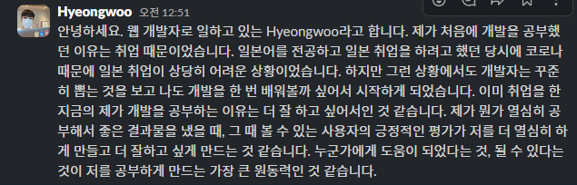

# TIL 에피소드 06 ~ 에피소드 10

## 오늘 TIL 3줄 요약

- 개인 공부를 할 때는 라이브러리 사용을 조금 더 선호하는 것 같다.
- 제이쿼리를 접한 이후로 사용해보지도 않은 예전 기술을 별로라고 생각하던 마음은 버리고, 그 기술이 왜 등장했고 어떤 문제를 해결했는지 생각해보게 되었다.
- aws 공부를 하면서 도메인을 구입해봤다.

## TIL (Today I Learned) 날짜

2024-07-30

## 오늘 읽은 범위

- 에피소드 11: 라이브러리와 프레임워크, 비슷한 거 아냐?
- 에피소드 12: 제이쿼리는 반드시 배워야 하는 기술일까?
- 에피소드 13: 그놈의 API, 대체 뭐길래?
- 에피소드 14: 도메인은 왜 돈을 주고 사야 할까?
- 에피소드 15: 플래시의 서비스 종료와 스티브 잡스

## 책에서 기억하고 싶은 내용을 써보세요.

### 에피소드 11: 라이브러리와 프레임워크, 비슷한 거 아냐?

- 라이브러리

  - 어떤 도구에 대해서 모든 결정을 다 내릴 수 있다.
  - 예시: 제이쿼리, 부트스트랩, 테일윈드 CSS 등

- 프레임워크
  - 누군가 정한 규칙에 따라 도구를 사용할 수 있다.
  - 예시: 장고, 스프링

### 에피소드 12: 제이쿼리는 반드시 배워야 하는 기술일까?

- 제이쿼리가 해결한 문제
  - 브라우저 호환성 문제 해결
  - 코드를 깔끔하게 작성할 수 있게 해줌
- 최근의 제이쿼리
  - 자바스크립트의 기능과 편의성이 증가하고 브라우저 호환성도 좋아져서 반드시 배워야하는 기술 스택은 아님

### 에피소드 13: 그놈의 API, 대체 뭐길래?

- API: 프로그램끼리 소통할 때 쓰는 일종의 규칙을 코드화 한 것.
- 웹 API: 브라우저와 개발자를 위해 만들어진 API
- API 작동 방식의 특징: 사용자는 API의 작동 방식을 모르더라도 상관없다.

### 에피소드 14: 도메인은 왜 돈을 주고 사야 할까?

- 도메인 시스템: 브라우저에 IP 주소와 연동된 이름(도메인)을 입력하면, 해당 IP의 웹사이트로 이동할 수 있게 해주는 시스템

- 레지스트리

  - IP 주소와 도메인을 적은 전화번호부
  - 기업에서 운영하는 것으로 가장 유명한 것은 베리사인이 관리하는 닷컴(.com)이 있다.

- 도메인 구입
  - 도메인은 레지스트리를 관리하는 기업이 아닌, 도메인 리셀러 업체에서 구입한다.
  - 도메인을 레지스트리에 등록하는 과정이 복잡하기 때문에 리셀러가 필요하다.

### 에피소드 15: 플래시의 서비스 종료와 스티브 잡스

- 플래시: 게임, 영상을 제공하는 웹 사이트에서 사용하는 프로그램

  - 처음에는 웹에서 사용하려고 만든 것은 아니었으나, 이를 인수한 매크로미디어가 애니메이션을 브라우저에 띄우는 데 사용할 수 있다는 가능성을 발견하며 플래시 플레이어 플러그인이 생김
  - 플래시는 당시에 웹 사이트를 아름답게 꾸밀 수 있는 방법 중 하나였음

- 스티브 잡스가 ios에서 플래시를 금지한 이유
  - 플래시는 오프 소스가 아니기 때문에 어도비라는 회사에 의존하게 됨.
  - ios는 손가락 터치를 많이 사용하는데, 플래시는 마우스 친화적임.

## 오늘 읽은 소감은? 떠오르는 생각을 가볍게 적어보세요

### 에피소드 11: 라이브러리와 프레임워크, 비슷한 거 아냐?

> 개발을 하다보면 라이브러리와 프레임워크 둘 다 사용하게 되지만, 개인적으로는 라이브러리를 좀 더 선호한다. 프레임워크를 사용하다보면 갑갑함을 느낄 때도 있고, 때로는 이렇게 쉽게 만들어도 되나 싶을 때도 있다. 라이브러리를 사용하며 직접 제어하면서 배울 수 있는 것이 더 많기도 한 것 같아서 개인 공부를 할 때는 라이브러리 사용을 조금 더 선호하는 것 같다.

### 에피소드 12: 제이쿼리는 반드시 배워야 하는 기술일까?

> 리액트가 한창 흥할 때 개발공부를 시작했기 때문에 제이쿼리는 배워본 적도 없었지만, 제이쿼리가 낡은 기술이라는 말을 계속 들어서 그런지 해본 적도 없이 제이쿼리는 별로라는 생각을 가지기도 했다. 하지만, 일을 하면서 리액트를 사용할 수 없는 상황이 생겨서 제이쿼리를 처음 써봤는데 생각보다 사용 경험이 좋았다. 리액트가 없던 시절, 바닐라 자바스크립트로만 코딩 했을 때에 제이쿼리를 만났다면 나 역시도 꽤 좋아했을 것 같다. 제이쿼리를 접한 이후로 사용해보지도 않은 예전 기술을 별로라고 생각하던 마음은 버리고, 그 기술이 왜 등장했고 어떤 문제를 해결했는지 생각해보게 되었다.

### 에피소드 13: 그놈의 API, 대체 뭐길래?

> 나도 처음에는 API를 이해하기 너무 어려웠다. 니꼬쌤 영상을 봤을 때도 사실 이해하지 못 했다. API라고 부를 수 있는 것의 범위가 워낙 넓어서 그랬던 것 같다. 초보자 입장에서는 추상적이기도 하고 말이다. 실제로 API를 많이 사용해보고 나서야 이해했던 것 같다.

### 에피소드 14: 도메인은 왜 돈을 주고 사야 할까?

> 최근에 aws 공부를 하면서 처음으로 도메인을 구입해봤는데, 이름 지을 때 참 고민을 많이 했던 기억이 난다. 공부용으로 구입한 도메인인데, 추후 블로그를 만들면 그 도메인을 사용할 것 같다.

## 슬랙인증: 내가 개발을 공부하는 이유는?

