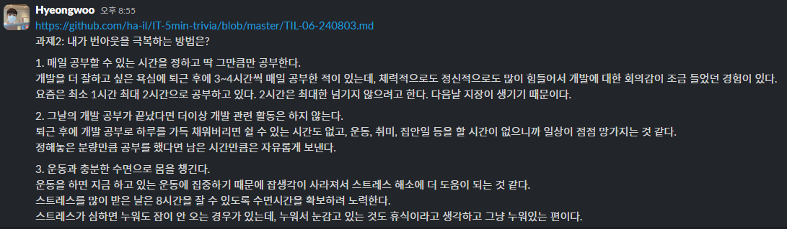

# TIL 에피소드 26 ~ 에피소드 29

## 오늘 TIL 3줄 요약

- 추상 자료구조는 기존 프로그래밍 언어의 문법으로 데이터를 저장할 때 어떤 규칙만 부여하기만 하면 되는 자료구조를 의미한다.

- 해시테이블의 검색이 빠른 이유는 해시 함수를 이용해 key를 인덱스로 바꾸기 때문이다.

- 클린코드란 코드를 읽기만 해도 이 코드가 무슨 일을 하는지, 어떤 것을 의미하는지 이해되는 코드를 말한다.

## TIL (Today I Learned) 날짜

2024-08-03

## 오늘 읽은 범위

- 에피소드 26: 정렬 알고리즘이 뭐죠?
- 에피소드 27: 스택, 큐가 뭐죠?
- 에피소드 28: 해시 테이블이 뭐죠?
- 에피소드 29: 개발자 필수 소양, 클린 코드!

## 책에서 기억하고 싶은 내용을 써보세요.

### 에피소드 26: 정렬 알고리즘이 뭐죠?

- 버블 정렬:

  - 시간 복잡도: O(N²)
  - 배열 기준으로 두 요소를 선택하고, 두 요소가 정렬되어있다면 놔두고 아니라면 두 요소의 값을 교체하는 방식으로 진행되는 정렬 방식

- 선택 정렬

  - 시간 복잡도: O(N²)
  - 주어진 배열에서 최솟값을 찾고, 그 값을 맨 앞에 위치한 값과 교체한 다음, 이 작업을 맨 앞 위치한 값을 뺀 나머지 배열에 대해서 반복하는 정렬 알고리즘

- 삽입 정렬
  - 시간 복잡도: O(N²)
  - 배열의 모든 요소를 앞에서부터 차례대로 이미 정렬된 배열 부분과 비교하여, 자신의 위치를 찾아 삽입함으로써 정렬을 완성하는 알고리즘

### 에피소드 27: 스택, 큐가 뭐죠?

- 추상 자료구조(ADT: abstract data type)

  - 배열처럼 문법이 따로 있는 것이 아니라, 기존 프로그래밍 언어의 문법으로 데이터를 저장할 때 어떤 규칙만 부여하기만 하면 되는 자료구조.

- 스택

  - LIFO(last in, first out)
  - 규칙1: 위에서 데이터를 쌓는다
  - 규칙2: 위에서부터 데이터를 뺀다.
  - 실제 예: 웹 브라우저의 뒤로 가기 버튼, 되돌리기 단축키

- 큐
  - FIFO(first in, first out!)
  - 규칙1: 위로 데이터를 쌓는다.
  - 규칙2: 아래에서부터 데이터를 뺀다.
  - 실제 예: 쇼핑몰 주문 처리 시스템

### 에피소드 28: 해시 테이블이 뭐죠?

- 해시 테이블

  - 키와 값을 짝지어 모은 것
  - 검색 시 시간복잡도: O(1)

- 해시 테이블의 검색이 빠른이유
  - 해시 테이블은 배열로 되어 있음
  - 배열에서 값에 접근하고 싶으면 인덱스가 필요.
  - 해시 함수를 이용해 key를 인덱스로 바꾸기 때문에 검색 속도가 빠름
  - 바꾼 인덱스가 같은 경우가 있을 수 있는데, 이런 상황을 해시 충돌이라 함
  - 인덱스에 또다른 배열을 넣는 것으로 충돌을 해결
  - 인덱스 안에 또다른 배열이 있기 때문에 항상 O(1)인 것은 아님.

### 에피소드 29: 개발자 필수 소양, 클린 코드!

- 클린코드
  - 설명이 필요없는 코드를 말 함. 코드를 읽기만 해도 이 코드가 무슨 일을 하는지, 어떤 것을 의미하는지 이해되는 코드.
  - 클린코드1: 의미 있는 변수, 함수의 이름을 적절히 사용하라
  - 클린코드2: 함수 이름은 가급적 동사로 지어라.
  - 클린코드3: 매개변수는 너무 많이 쓰지 마라
  - 클린코드4: 불린값을 인자로 보내지마라
  - 클린코드5: 축약어를 쓰지 마라

## 오늘 읽은 소감은? 떠오르는 생각을 가볍게 적어보세요

### 에피소드 26: 정렬 알고리즘이 뭐죠?

> 알고리즘을 처음 배울 때, 버블 정렬에는 왜 '버블'이라는 단어가 들어갈까? 궁금했던 적이 있다. 알고보니, 물방울이 아래에서 위로 올라가는 것처럼, 정렬이 이뤄지기 때문에 버블 정렬이라는 이름이 붙었다고 한다. 뭔가 굉장히 개발자스러운 작명이라 생각했다.

### 에피소드 27: 스택, 큐가 뭐죠?

> "큐나 스택은 배열처럼 문법이 따로 없다. 큐나 스택은 기존 프로그래밍 언어의 문법으로 데이터를 저장할 때 어떤 규칙만 부여하면 되기 때문이다."라는 내용이 책에 나오는데, 이렇기 때문에 내가 처음에 스택과 큐를 이해하기가 꽤 어려웠던 것 같다. 배열과 객체에 비해서 추상적이기 때문이다.

### 에피소드 28: 해시 테이블이 뭐죠?

> 프로그래밍을 배운지 얼마 안 됐을 때는, 배열로만 데이터를 다루는 것에 익숙해서, 뭔가 검색해야 하는 상황에서도 배열을 썼던 기억이 있다. 해시 테이블을 배운다음부터는 검색이 필요한 상황에서는 해시 테이블을 주로 활용하고 있다.

### 에피소드 29: 개발자 필수 소양, 클린 코드!

> 클린코드라는 책은 워낙 유명해서 나도 읽어봤는데, 그 책을 읽었을 때는 개발 공부를 시작한지 6개월 정도 되었을 때라, 내용이 잘 이해 되지 않았다. 지금보면 또 다를까 싶다.

> 이번에 나온 내용 중에서 "매개 변수를 많이 쓰지 마라"라는 규칙을 평소 코딩할 때도 잘 쓰고 있어서 내용이 반가웠다. 확실히 매개변수가 여러개일 때는 객체형태로 인자를 다루는 것이 좋다고 느껴진다. 매개변수가 여러개인 함수를 호출한 코드를 보면, 호출 시 인자만 봤을 때 함수의 동작 파악이 어려울 수도 있는데, 이를 객체로 만들어 전달할 수 있다면, 각 값에 키가 붙으니까 좀 더 이해하기 쉬운 것 같다. 요즘은 IDE에 자동완성이 잘 되어 있어서 객체로 전달할 경우 자동완성의 이점도 누릴 수 있다는 것도 좋은 것 같다.

## 나만의 번아웃 예방 방법

개발에서 번아웃이란 더 이상 개발이 하기 싫어지는 상태가 아닐까 싶다.
그런 의미의 번아웃이라면 사실 아직 경험한 적은 없은 없지만, 이러다가 번아웃 오겠는데 싶은 적은 몇 번 있었다.
그럴때 마다 했던 내 행동을 정리해봤다.

### 1. 매일 공부할 수 있는 시간을 정하고 딱 그만큼만 공부한다.

나는 어떤 것을 습관으로 만든다면 적은 시간이더라도 매일 하는 것이 효과적이라고 생각한다. 그리고 정말 매일 해야 한다면 평일을 기준으로 너무 많은 시간을 할당할 수는 없을 것이라 생각한다.

개발공부도 마찬가지인 것 같다. 개발자는 사실 퇴근 후에도 주말에도 매일 공부해야 하는데, 매일 너무 많은 시간을 개발 공부에 할애한다면 그것을 습관으로 만들기는 어려울 수도 있고, 번아웃이 올 수도 있다.

개발을 더 잘하고 싶은 욕심에 퇴근 후에 3~4시간씩 매일 공부한 적이 있는데, 체력적으로도 정신적으로도 많이 힘들어서 개발에 대한 회의감이 조금 들었던 경험이 있다. 요즘은 최소 1시간 최대 2시간으로 공부하고 있다. 2시간은 최대한 넘기지 않으려고 한다. 다음날 지장이 생기기 때문이다.

### 2. 그날의 개발 공부가 끝났다면 더이상 개발 관련 활동은 하지 않는다.

퇴근도 했고, 그날 정한만큼의 시간동안 개발 공부도 했다면, 그 날만큼은 더 이상 개발과 관련된 활동은 하지 않으려 노력한다.

퇴근 후에 개발 공부로 하루를 가득 채워버리면 쉴 수 있는 시간도 없고, 운동, 취미, 집안일 등을 할 시간이 없으니까 일상이 점점 망가지는 것 같다.

정해놓은 분량만큼 공부를 했다면 남은 시간만큼은 자유롭게 보낸다.

### 3. 운동과 충분한 수면으로 몸을 챙긴다.

개발에 대한 번아웃은 보통 정신적인 스트레스라고 생각한다.

나의 경우 정신적인 스트레스를 육체적인 활동으로 푸는 편이다.

특히 달리기를 좋아하는데, 업무와 공부 후 저녁에 달리기를 하면, 그날 배웠던 것들이 머릿속에서 착착 정리된다는 느낌을 받기도 하고,
그날 고민했던 문제가 달리기를 하던 도중 풀리기도 하는 신기한 경험도 했었다.

게다가 운동을 하면 지금 하고 있는 운동에 집중하기 때문에 잡생각이 사라져서 스트레스 해소에 더 도움이 되는 것 같다.

마지막으로 수면은 언제나 중요한 것 같다. 잠을 잘 잔 날과 아닌 날의 차이가 이제는 너무 체감되어서 그런지, 스트레스를 많이 받은 날은 8시간을 잘 수 있도록 수면시간을 확보하려 노력한다.

물론, 스트레스가 심하면 누워도 잠이 안 오는 경우가 있는데, 누워서 눈감고 있는 것도 휴식이라고 생각하고 그냥 누워있는 편이다.

